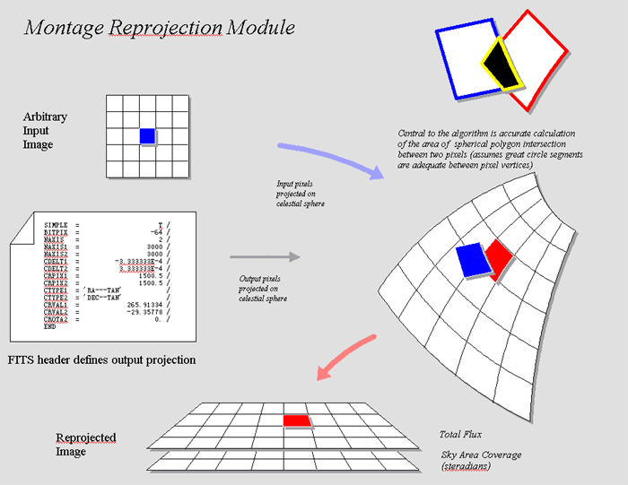
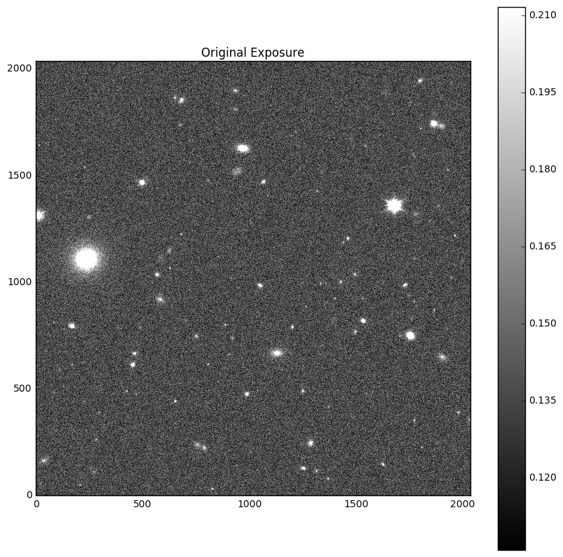
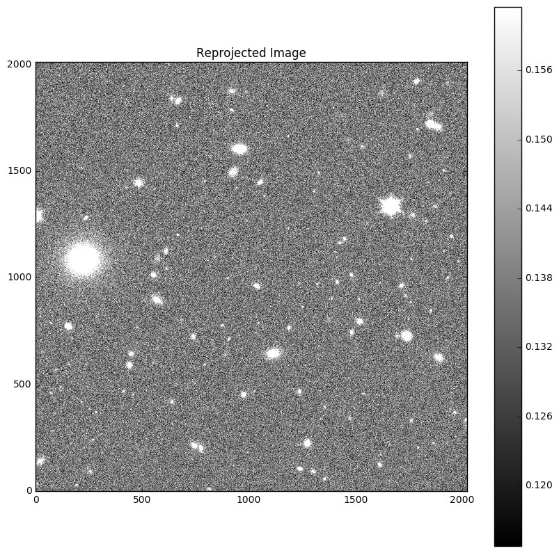

# Montage Algorithm

Please see http://montage.ipac.caltech.edu/ for the full Montage documentation.

# Reprojection of Images

The first step in performing a Montage image is to reproject the input exposure images. Here the goal is to "redistribute" pixel energy information from the input 
images to the output pixels. This is done by obtaining information about the overlap of pixels.

The overlap is found by first projecting the input pixels onto the celestial sphere (RA and DEC coordinates). Then with the user's supplied final mosaic header 
information (example below) the output pixel information is projected onto the same sphere. The overlap between the two projections is then calculated. 
The Montage algorithm uses a calculation of the area of two polygons on a sphere (see image below). This overlapping area information allows for a conversion of 
the input pixel energy to output pixel energy. Most mosaicing algorithms use a weighting method to produce a final image and this method is Montage's form of that. 
The weight as dertermined by the amount of overlap is added to input pixels.

Example header information:

SIMPLE =          T / conforms to FITS standard   
BITPIX =           -64 /array data type   
NAXIS =            2 / number of array dimensions  
NAXIS1 =          2797  
NAXIS2 =          2797  
EXTEND =         T  
CTYPE1 =  'RA---TAN'  
CTYPE2 =  'DEC--TAN'  
CRVAL1 =      53.1153485  
CRPIX1 =       1024.0  
CRVAL2 =      -27.8015545  
CRPIX2 =      1024.0  
CD1_1 =        8.6466189E-06   
CD1_2 =       1.227034E-07   
CD2_1 =       -1.219408E-07   
CD2_2 =       8.7006938E-06   

END

The above image is from http://montage.ipac.caltech.edu/docs/algorithms.html

Below is an example of an original exposure and it's reprojected input image.

# Background Matching

After the reprojection is completed the differences in background will be removed. To do this, the physical overlap between neighboring reprojected images are found. 
A least squares fit is then used to determine the pixel differences in these images. Half of the correction is applied, and the process is repeated until differences 
in overlaping images are very small.

# Final Mosaic

The final mosaic image is combined based on the weight information from the reprojection process. As stated in the documentation, "output pixel value is 
simply the area-weighted average of the images being combined."
